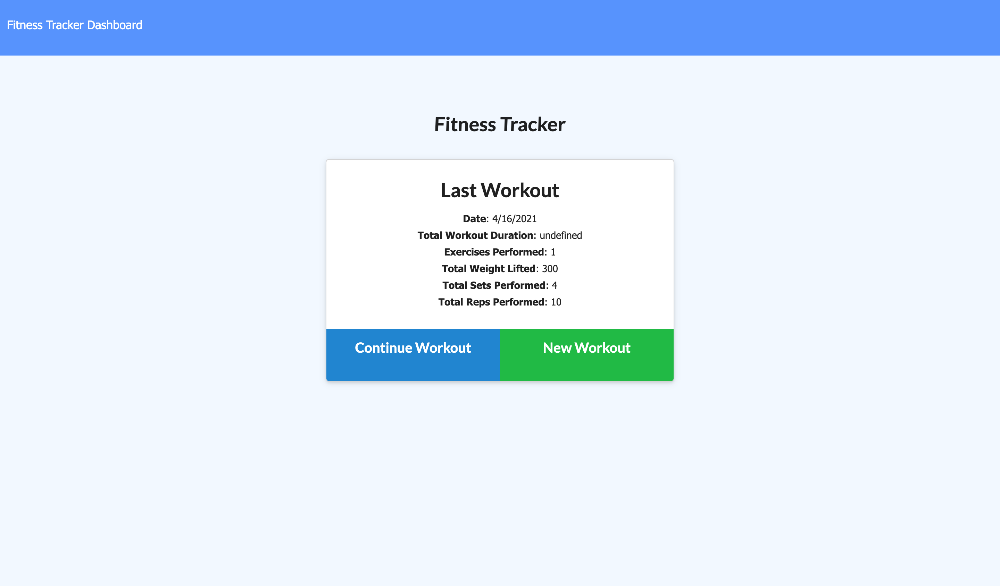
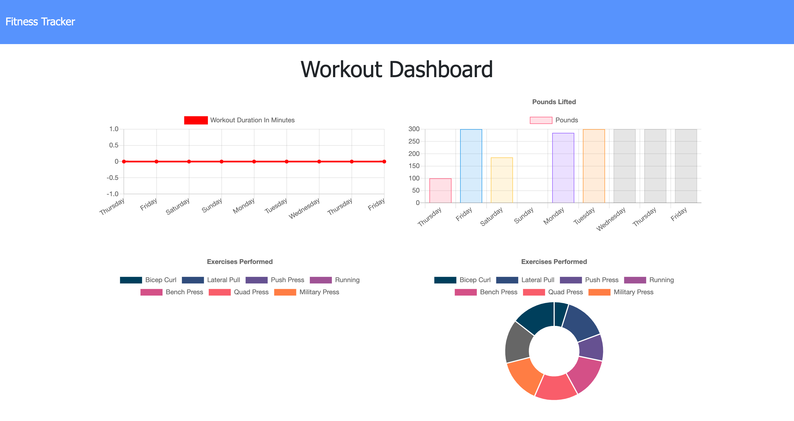

# fitness_tracker

# Description

Fitness tracker application using MongoDB and express.



## Table of Contents (Optional)


* [Installation](#installation)
* [Usage](#usage)
* [Credits](#credits)
* [License](#license)


## Installation

- Download this repo to your local machine.
- Once in the repo file in your terminal use "npm install" to make sure you have inquirer install.
- Connect your local/atlas mongo server.
- run "npm run seed"
- run "node server"


## Usage 

```
- JavaScript
- MongoDB
- mongoose
- Express
- node

```


## Credits
Credit to [Mike Fearnley](https://michaelfearnley.com/) and [Scott Byers](https://github.com/switch120)

and the UNH Fullstack Coding Bootcamp

## Links 

[Fitness Tracker Link](https://protected-badlands-77846.herokuapp.com/)


## Contact

if you want to contact me for any more questions here are my links!

hello@taylorgonz.com
\
[Website](http://www.taylorgonz.com)
\
[Linked in](https://www.linkedin.com/in/taylorgonz/)

## Licensing
This project is licensed by : 

[](https://lbesson.mit-license.org/) \
click the badge for more info